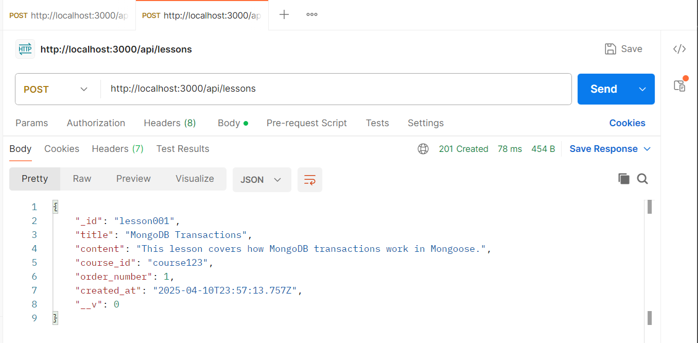
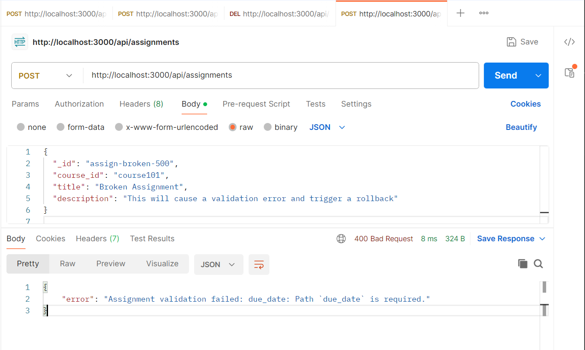

## 1. **ACID Transactions in MongoDB**

### **Implementation Overview**

The project extensively uses MongoDB's ACID transaction capabilities to ensure data consistency and reliability. Transactions are implemented in various controllers, such as `lessonController.js`, `examController.js`, `assignmentController.js`, and others. Each transaction begins with `mongoose.startSession()` and ensures atomicity by committing or aborting the transaction based on the operation's success or failure.

### **Error Handling Strategies**

- **Error Detection:** Errors are caught using `try-catch` blocks.
- **Rollback Mechanism:** If an error occurs, the transaction is aborted using `session.abortTransaction()`, ensuring no partial updates are made to the database.
- **Session Management:** Each transaction ends with `session.endSession()` to release resources.

### **Examples**

#### Successful Transaction

In the `createLesson` function:

```javascript
const session = await mongoose.startSession();
session.startTransaction();

try {
  const lesson = new Lesson(req.body);
  await lesson.save({ session });
  await session.commitTransaction();
  session.endSession();
  res.status(201).json(lesson);
} catch (error) {
  await session.abortTransaction();
  session.endSession();
  res.status(400).json({ error: error.message });
}
```

#### Rollback on Failure

In the `deleteAssignment` function:

```javascript
const session = await mongoose.startSession();
session.startTransaction();

try {
  const assignment = await Assignment.findByIdAndDelete(req.params.id, {
    session,
  });
  if (!assignment) {
    await session.abortTransaction();
    session.endSession();
    return res.status(404).json({ message: "Assignment not found" });
  }
  await session.commitTransaction();
  session.endSession();
  res.json({ message: "Assignment deleted successfully" });
} catch (error) {
  await session.abortTransaction();
  session.endSession();
  res.status(500).json({ error: error.message });
}
```

### **Test Cases**

1. **Successful Transaction:** Creating a lesson with valid data results in a new lesson being saved to the database.
2. **Rollback on Failure:** Attempting to delete a non-existent assignment triggers a rollback, ensuring no unintended changes are made.

---

## 2. **Role-Based Access Control (RBAC) & Security**

### **Role Definitions**

The platform defines the following roles:

- **Admin:** Full access to manage users, courses, lessons, and other resources.
- **Instructor:** Can create and manage courses, lessons, and assignments.
- **Student:** Can enroll in courses, submit assignments, and take exams.

### **Implementation Details**

RBAC is implemented using middleware functions in `authMiddleware.js`:

- **Authentication Middleware:** Verifies JWT tokens to ensure the user is authenticated.
- **Role Middleware:** Checks if the user's role matches the required permissions for the endpoint.

#### Example: Role Middleware

```javascript
export const roleMiddleware = (roles) => (req, res, next) => {
  if (!roles.includes(req.user.role)) {
    return res.status(403).json({ message: "Access denied" });
  }
  next();
};
```

### **Examples**

1. **Admin Access:** Only admins can delete users.
   ```javascript
   app.delete(
     "/users/:id",
     authMiddleware,
     roleMiddleware(["admin"]),
     deleteUser
   );
   ```
2. **Instructor Access:** Only instructors can create lessons.
   ```javascript
   app.post(
     "/lessons",
     authMiddleware,
     roleMiddleware(["instructor"]),
     createLesson
   );
   ```

### **Security Measures**

- **JWT Authentication:** Ensures secure communication between the client and server.
- **Password Hashing:** User passwords are stored as hashed values for security.
  -# Project Report: 5200 Online Learning Platform

## 1. **ACID Transactions in MongoDB**

### **Implementation Overview**

The project extensively uses MongoDB's ACID transaction capabilities to ensure data consistency and reliability. Transactions are implemented in various controllers, such as `lessonController.js`, `examController.js`, `assignmentController.js`, and others. Each transaction begins with `mongoose.startSession()` and ensures atomicity by committing or aborting the transaction based on the operation's success or failure.

### **Error Handling Strategies**

- **Error Detection:** Errors are caught using `try-catch` blocks.
- **Rollback Mechanism:** If an error occurs, the transaction is aborted using `session.abortTransaction()`, ensuring no partial updates are made to the database.
- **Session Management:** Each transaction ends with `session.endSession()` to release resources.

### **Examples**

#### Successful Transaction

In the `createLesson` function:

```javascript
const session = await mongoose.startSession();
session.startTransaction();

try {
  const lesson = new Lesson(req.body);
  await lesson.save({ session });
  await session.commitTransaction();
  session.endSession();
  res.status(201).json(lesson);
} catch (error) {
  await session.abortTransaction();
  session.endSession();
  res.status(400).json({ error: error.message });
}
```

Begining of transaction:
```javascript
session.startTransaction();
```
End of transaction:
```javascript
await session.commitTransaction();
```
The Lesson collection is affected. A new Lesson document is inserted using the session.

Screenshot:


#### Rollback on Failure

In the `createAssignment` function:
```javascript
export const createAssignment = async (req, res) => {
  const session = await mongoose.startSession();
  session.startTransaction();

  try {
    const assignment = new Assignment(req.body);

    // Save the assignment within the transaction
    await assignment.save({ session });

    // Commit the transaction
    await session.commitTransaction();
    session.endSession();

    res.status(201).json(assignment);
  } catch (error) {
    // Abort the transaction in case of an error
    await session.abortTransaction();
    session.endSession();

    res.status(400).json({ error: error.message });
  }
};
```
Begining of transaction:
```javascript
session.startTransaction();
```
End of transaction:
```javascript
session.abortTransaction();
```
(when transaction unsuccessful)
The Assignment collection is affected. Single document created.

Rollback mechanism: If the assignment is not found or an error occurs, ```abortTransaction()``` is called.
Session Cleanup:	```session.endSession()``` is called in both success and failure branches to release resources.

Screenshot:


### **Test Cases**

1. **Successful Transaction:** Creating a lesson with valid data results in a new lesson being saved to the database.
2. **Rollback on Failure:** Attempting to delete a non-existent assignment triggers a rollback, ensuring no unintended changes are made.

---

## 2. **Role-Based Access Control (RBAC) & Security**

### **Role Definitions**

The platform defines the following roles:

- **Admin:** Full access to manage users, courses, lessons, and other resources.
- **Instructor:** Can create and manage courses, lessons, and assignments.
- **Student:** Can enroll in courses, submit assignments, and take exams.

### **Implementation Details**

RBAC is implemented using middleware functions in `authMiddleware.js`:

- **Authentication Middleware:** Verifies JWT tokens to ensure the user is authenticated.
- **Role Middleware:** Checks if the user's role matches the required permissions for the endpoint.

#### Example: Role Middleware

```javascript
export const roleMiddleware = (roles) => (req, res, next) => {
  if (!roles.includes(req.user.role)) {
    return res.status(403).json({ message: "Access denied" });
  }
  next();
};
```

### **Examples**

1. **Admin Access:** Only admins can delete users.
   ```javascript
   app.delete(
     "/users/:id",
     authMiddleware,
     roleMiddleware(["admin"]),
     deleteUser
   );
   ```
2. **Instructor Access:** Only instructors can create lessons.
   ```javascript
   app.post(
     "/lessons",
     authMiddleware,
     roleMiddleware(["instructor"]),
     createLesson
   );
   ```

### **Security Measures**

- **JWT Authentication:** Ensures secure communication between the client and server by validating JSON Web Tokens (JWT) for each request.
- **Password Hashing:** User passwords are securely stored as hashed values using algorithms like bcrypt to prevent unauthorized access in case of a data breach.
- **Error Responses:** Unauthorized or forbidden access triggers appropriate HTTP status codes:
  - `401 Unauthorized`: Returned when the user is not authenticated.
  - `403 Forbidden`: Returned when the user does not have the required permissions to access a resource.

## 3. **Advanced MongoDB Queries & Aggregation**

### **Purpose and Implementation**

The project uses MongoDB's aggregation framework to derive insights and perform complex queries. These queries are optimized for performance and provide valuable business insights.

### **Examples**

#### 1. **Get Student Counts for Each Course**

**Purpose:** Determine the popularity of courses.

```javascript
const result = await Enrollment.aggregate([
  { $group: { _id: "$course_id", studentCount: { $sum: 1 } } },
  {
    $lookup: {
      from: "courses",
      localField: "_id",
      foreignField: "_id",
      as: "courseDetails",
    },
  },
  { $unwind: "$courseDetails" },
  {
    $project: {
      courseId: "$_id",
      courseTitle: "$courseDetails.title",
      studentCount: 1,
    },
  },
  { $sort: { studentCount: -1 } },
]);
```

**Business Value:** Helps identify high-demand courses for resource allocation.

#### 2. **Get Average Grades for Each Course**

**Purpose:** Evaluate course performance.

```javascript
const result = await Submission.aggregate([
  {
    $group: {
      _id: "$assignmentDetails.course_id",
      averageGrade: { $avg: "$grade" },
    },
  },
  {
    $lookup: {
      from: "courses",
      localField: "_id",
      foreignField: "_id",
      as: "courseDetails",
    },
  },
  { $unwind: "$courseDetails" },
  {
    $project: {
      courseId: "$_id",
      courseTitle: "$courseDetails.title",
      averageGrade: { $round: ["$averageGrade", 2] },
    },
  },
]);
```

**Business Value:** Identifies courses where students may need additional support.

#### 3. **Get Assignment Counts for Each Course**

**Purpose:** Track workload distribution.

```javascript
const result = await Assignment.aggregate([
  { $group: { _id: "$course_id", assignmentCount: { $sum: 1 } } },
  {
    $lookup: {
      from: "courses",
      localField: "_id",
      foreignField: "_id",
      as: "courseDetails",
    },
  },
  { $unwind: "$courseDetails" },
  {
    $project: {
      courseId: "$_id",
      courseTitle: "$courseDetails.title",
      assignmentCount: 1,
    },
  },
  { $sort: { assignmentCount: -1 } },
]);
```

**Business Value:** Ensures balanced workloads across courses.

### **Sample Results**

1. **Student Counts for Each Course:**

   ```json
   [
     { "courseId": "c8", "courseTitle": "Modern Physics", "studentCount": 120 },
     {
       "courseId": "c6",
       "courseTitle": "Organic Chemistry I",
       "studentCount": 95
     }
   ]
   ```

2. **Average Grades for Each Course:**

   ```json
   [
     {
       "courseId": "c12",
       "courseTitle": "Machine Learning 101",
       "averageGrade": 85.5
     },
     {
       "courseId": "c17",
       "courseTitle": "Physical Chemistry",
       "averageGrade": 78.3
     }
   ]
   ```

3. **Assignment Counts for Each Course:**
   ```json
   [
     {
       "courseId": "c3",
       "courseTitle": "Data Structures",
       "assignmentCount": 10
     },
     { "courseId": "c5", "courseTitle": "Algorithms", "assignmentCount": 8 }
   ]
   ```

---

This section demonstrates the use of MongoDB's aggregation framework to provide actionable insights and support data-driven decision-making.
