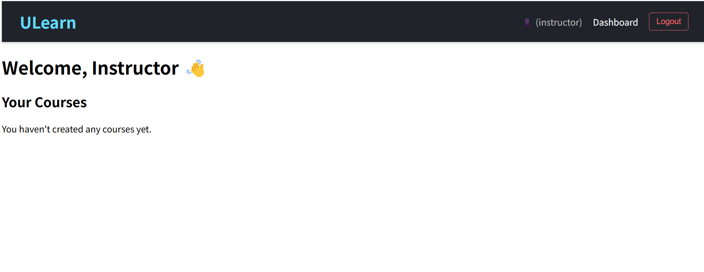
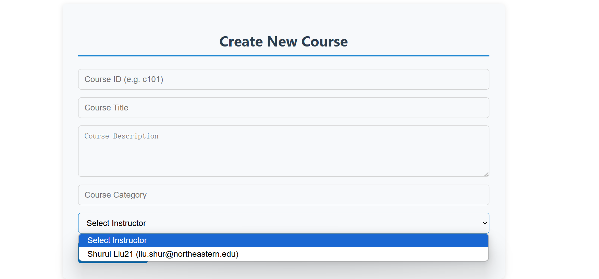
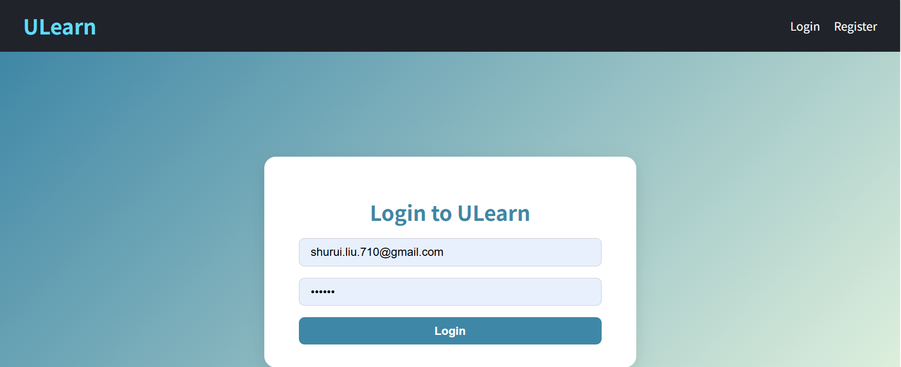

# 📊 Dashboard Features Documentation

This document provides a detailed explanation of the dashboard features in the **5200 Online Learning Platform**, including screenshots and how they correspond to relevant MongoDB collections and queries.

---

## 🖥️ **Admin Dashboard**


### **Features**

1. **User Statistics**

   - Displays the total number of users, instructors, students, and courses.
   - Corresponding Query:
     ```javascript
     const users = await User.find();
     const instructors = users.filter(
       (user) => user.role === "instructor"
     ).length;
     const students = users.filter((user) => user.role === "student").length;
     const courses = await Course.find().countDocuments();
     ```
   - **Collections Used**: users, courses

2. **User Role Distribution (Pie Chart)**

   - Visualizes the distribution of instructors, students, and admins.
   - Corresponding Query:
     ```javascript
     const stats = {
       instructors: users.filter((user) => user.role === "instructor").length,
       students: users.filter((user) => user.role === "student").length,
       admins: users.length - instructors - students,
     };
     ```
   - **Collections Used**: user

3. **Course Management**

   - Allows admins to view, add, and manage courses.
   - Corresponding Query:
     ```javascript
     const courses = await Course.find();
     ```
   - **Collections Used**: courses

---

## 🧑‍🏫 **Instructor Dashboard**



### **Features**

1. **Course List**

   - Displays all courses created by the instructor, along with the number of enrolled students.
   - Corresponding Query:
     ```javascript
     const courses = await Course.find({ instructor_id: req.user.id }).populate(
       "enrollments"
     );
     ```
   - **Collections Used**: courses, enrollment

2. **Student Enrollment Chart**

   - Bar chart showing the number of students enrolled in each course.
   - Corresponding Query:
     ```javascript
     const result = await Enrollment.aggregate([
       { $group: { _id: "$course_id", studentCount: { $sum: 1 } } },
       {
         $lookup: {
           from: "courses",
           localField: "_id",
           foreignField: "_id",
           as: "courseDetails",
         },
       },
       { $unwind: "$courseDetails" },
       {
         $project: {
           courseId: "$_id",
           courseTitle: "$courseDetails.title",
           studentCount: 1,
         },
       },
     ]);
     ```
   - **Collections Used**: enrollments, courses

3. **Course Actions**

   - Instructors can view or edit their courses.
   - **Collections Used**: courses

---

## 👩‍🎓 **Student Dashboard**


### **Features**

1. **Enrolled Courses**

   - Displays all courses the student is enrolled in, along with the instructor's name.
   - Corresponding Query:
     ```javascript
     const enrollments = await Enrollment.find({ student_id: req.user.id });
     const courseIds = enrollments.map((e) => e.course_id);
     const courses = await Course.find({ _id: { $in: courseIds } }).populate(
       "instructor_id"
     );
     ```
   - **Collections Used**: enrollments, users

2. **Browse More Courses**

   - Provides a link to browse available courses.
   - **Collections Used**: courses

---

## 📚 **Corresponding MongoDB Queries**

### **1. Get Student Counts for Each Course**

- **Purpose**: Display the number of students enrolled in each course.
- **Query**:
  ```javascript
  const result = await Enrollment.aggregate([
    { $group: { _id: "$course_id", studentCount: { $sum: 1 } } },
    {
      $lookup: {
        from: "courses",
        localField: "_id",
        foreignField: "_id",
        as: "courseDetails",
      },
    },
    { $unwind: "$courseDetails" },
    {
      $project: {
        courseId: "$_id",
        courseTitle: "$courseDetails.title",
        studentCount: 1,
      },
    },
  ]);
  ```

### **2. Get Instructor Course Counts**

- **Purpose**: Display the number of courses created by each instructor.
- **Query**:
  ```javascript
  const result = await Course.aggregate([
    { $group: { _id: "$instructor_id", courseCount: { $sum: 1 } } },
    {
      $lookup: {
        from: "users",
        localField: "_id",
        foreignField: "_id",
        as: "instructorDetails",
      },
    },
    { $unwind: "$instructorDetails" },
    {
      $project: {
        instructorId: "$_id",
        instructorName: "$instructorDetails.name",
        courseCount: 1,
      },
    },
  ]);
  ```
- **Collections Used**: courses, users

### **3. Get Total Revenue for Each Course**

- **Purpose**: Display the total revenue generated by each course.
- **Query**:
  ```javascript
  const result = await Enrollment.aggregate([
    { $group: { _id: "$course_id", totalRevenue: { $sum: "$fee" } } },
    {
      $lookup: {
        from: "courses",
        localField: "_id",
        foreignField: "_id",
        as: "courseDetails",
      },
    },
    { $unwind: "$courseDetails" },
    {
      $project: {
        courseId: "$_id",
        courseTitle: "$courseDetails.title",
        totalRevenue: 1,
      },
    },
  ]);
  ```
- **Collections Used**: enrollments, courses

### **4. Get User Role Distribution**

- **Purpose**: Display the distribution of user roles (e.g., instructors, students, admins).
- **Query**:
  ```javascript
  const users = await User.find();
  const stats = {
    instructors: users.filter((user) => user.role === "instructor").length,
    students: users.filter((user) => user.role === "student").length,
    admins:
      users.length -
      users.filter((user) => user.role === "instructor").length -
      users.filter((user) => user.role === "student").length,
  };
  ```
- **Collections Used**: users

### **5. Get Enrolled Courses for a Student**

- **Purpose**: Display all courses a student is enrolled in, along with the instructor's name.
- **Query**:
  ```javascript
  const enrollments = await Enrollment.find({ student_id: req.user.id });
  const courseIds = enrollments.map((e) => e.course_id);
  const courses = await Course.find({ _id: { $in: courseIds } }).populate(
    "instructor_id"
  );
  ```
- **Collections Used**: enrollments, courses, users

---

### **Screenshots**

All screenshots referenced in this document are stored in the `./screenshots/` directory for easy access:

1. **Admin Dashboard**:  
   

2. **Browse All Courses**:  
   

3. **Create Course (Admin)**:  
   

4. **Instructor Dashboard**:  
   

5. **Login Page**:  
   

6. **Register Page**:  
   

7. **Student Enrollment Chart**:  
   

8. **User Distribution**:  
   

9. **Student Dashboard**:  
   

10. **View Course**:  
    
